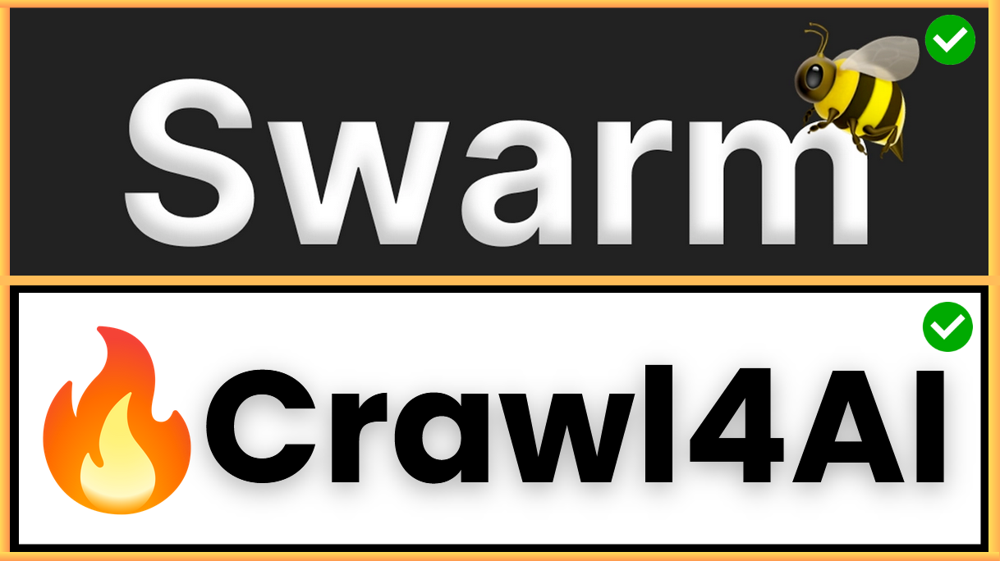

<p align="center">
  <a href="http://bit.ly/SUBSCRIBE2JOSH">
    
  </a>
</p>

<h1 align="center">🤖 Stride Swarm Crawl4AI Marketing Agent</h1>

<p align="center">
  A powerful multi-agent system leveraging [OpenAI Swarm](https://github.com/openai/swarm) for AI-driven marketing strategies and [Crawl4AI](https://github.com/unclecode/crawl4ai) for advanced web scraping.
</p>

<div align="center">
  <a href="http://bit.ly/SUBSCRIBE2JOSH">
    
  </a>
</div>

## Overview

This project demonstrates the integration of Crawl4AI with OpenAI's Swarm framework to create an intelligent marketing assistant. It uses a team of specialized AI agents to analyze websites, generate marketing insights, and create campaign ideas.

## Features

1. **Multi-Agent System**: Uses OpenAI's Swarm to coordinate multiple specialized agents.
2. **Web Scraping**: Employs Crawl4AI to extract content from websites.
3. **Content Cleaning**: Processes raw HTML into clean, readable text.
4. **Content Analysis**: Utilizes OpenAI's GPT models to analyze website content.
5. **Campaign Idea Generation**: Creates innovative marketing campaign concepts based on target audience and goals.
6. **Marketing Copy Creation**: Generates compelling marketing copy based on campaign ideas.
7. **File Output**: Saves all generated content as separate markdown files.

## Agents

1. **User Interface Agent**: Manages user interactions and coordinates other agents.
2. **Web Scraper Agent**: Extracts and cleans website content using Crawl4AI.
3. **Analyst Agent**: Analyzes website content and provides marketing insights.
4. **Campaign Idea Agent**: Generates marketing campaign ideas.
5. **Copywriter Agent**: Creates marketing copy based on campaign ideas.

## Requirements

- Python 3.10+
- [Crawl4AI](https://github.com/unclecode/crawl4ai) library
- [OpenAI API key](https://platform.openai.com/api-keys)
- [OpenAI Swarm](https://github.com/openai/swarm) library

## Setup

1. Clone this repository:
   ```
   git clone https://github.com/joshpocock/stride-swarm-crawl4ai-marketing-agent.git
   cd 002-stride-swarm-crawl4ai-marketing-agent
   ```

2. Create a virtual environment (optional but recommended):
   ```
   python -m venv venv
   source venv/bin/activate  # On Windows, use `venv\Scripts\activate`
   ```

3. Install the required packages:
   ```
   pip install -r requirements.txt
   ```

4. Install OpenAI Swarm:
   ```
   pip install git+https://github.com/openai/swarm.git
   ```
   Or, if you have SSH access:
   ```
   pip install git+ssh://git@github.com/openai/swarm.git
   ```

5. Set up your environment variables:
   - Copy the `.env.example` file to `.env`:
     ```
     cp .env.example .env
     ```
   - Edit the `.env` file and add your OpenAI API key:
     ```
     OPENAI_API_KEY=your_openai_api_key_here
     ```

## Usage

1. Run the main script to start the interactive demo:
   ```
   python main.py
   ```

2. Enter a URL when prompted to analyze a website.

3. Provide target audience and marketing goals when asked.

4. The system will generate and save the following files in a folder named after the website's domain:
   - `full_website_content.md`: Clean, readable version of the entire website content.
   - `website-content.md`: Extracted content based on marketing relevance.
   - `analysis.md`: Marketing analysis of the website content.
   - `campaign_idea.md`: Generated marketing campaign idea.
   - `marketing_copy.md`: Created marketing copy based on the campaign idea.
   - `marketing-plan.md`: A comprehensive marketing plan including all the above elements.

## Customization

You can customize the behavior of each agent by modifying their instructions and functions in the `main.py` file. Some ideas for customization:

- Adjust the Crawl4AI extraction strategy parameters in the `scrape_website` function.
- Modify the prompts for each agent to focus on specific marketing aspects.
- Add new agents or functions to expand the system's capabilities.

## Troubleshooting

- If you encounter any issues with Crawl4AI, ensure you have the latest version installed:
  ```
  pip install --upgrade crawl4ai
  ```
- For OpenAI API errors, check that your API key is correctly set in the `.env` file.
- Make sure you have Python 3.10 or higher installed, as OpenAI Swarm requires this version.

## Contributing

Contributions are welcome! Please feel free to submit a Pull Request.

## Acknowledgements

- [OpenAI Swarm](https://github.com/openai/swarm) for the multi-agent framework.
- [Crawl4AI](https://github.com/unclecode/crawl4ai) for the powerful web scraping capabilities.

## Community and Support

- **YouTube**: Daily videos on AI development, tutorials, and industry insights
- **Discord**: Join our vibrant community of AI enthusiasts and developers
- **Twitter**: Follow [@joshfpocock](https://twitter.com/joshfpocock) for updates and AI tips
- **Blog**: Check out [ExecutiveStride.com](https://executivestride.com) for in-depth articles and case studies
- **Email**: For business inquiries, contact josh@executivestride.com

---

## About the Author

<p align="center">
  
</p>

**Josh Pocock** is a serial entrepreneur, AI visionary, and founder of ExecutiveStride.com and StrideAgents.com. With a passion for leveraging AI to drive business growth and innovation, Josh has:

- Helped 300+ successful entrepreneurs through ExecutiveStride.com
- Authored the comprehensive "Client Acquisition Code" book
- Pioneered fully autonomous appointment setting agents with StrideAgents.com
- Dedicated his career to making AI accessible and impactful for businesses worldwide

Connect with Josh:
- [Instagram](https://www.instagram.com/joshfpocock/)
- [LinkedIn](https://www.linkedin.com/in/joshpocock13/)
- [Twitter](https://twitter.com/joshfpocock)
- [YouTube](http://bit.ly/SUBSCRIBE2JOSH)

---

## Revolutionize Your Business with Stride Agents

Transform your appointment booking and customer interactions with Stride Agents - cutting-edge AI technology designed to replace and outperform traditional call centers.

### Stride Agents: AI-Powered Efficiency

- **24/7 Autonomous Operation**: Handle voice calls and SMS texting round-the-clock
- **Cost-Effective**: Fraction of the cost of human agents
- **Instant Scalability**: Deploy a full AI call center overnight
- **Consistent Performance**: Tireless agents with perfect tonality, unaffected by rejection
- **Custom-Tailored**: Trained on your company's specific needs and brand voice
- **Proven Strategies**: Leveraging 10,000+ successful conversation pathways
- **Seamless Integration**: Direct scheduling into your CRM and calendar

### Why Choose Stride Agents?

- Eliminate training and management costs
- See immediate ROI, especially in voice and call center applications
- Focus on core business growth while AI handles customer interactions
- Leverage advanced AI for perfect conversation handling every time

Ready to stride into the future of business operations? 

**[Book a Call Now](https://executivestride.com/apply)** or visit [StrideAgents.com](http://StrideAgents.com) to learn how we can build an AI workforce for your business.

---

<p align="center">
  <strong>Ready to shape the future with AI? Let's stride forward together!</strong>
</p>

<p align="center">
  <a href="https://executivestride.com/apply">Book a Call</a> · 
  <a href="https://github.com/joshpocock/Stride-AI-Agents/stargazers">Star this Repo</a> · 
</p>

---

<p align="center">
  Made with ❤️ and AI by the Stride AI Agents Community
</p>